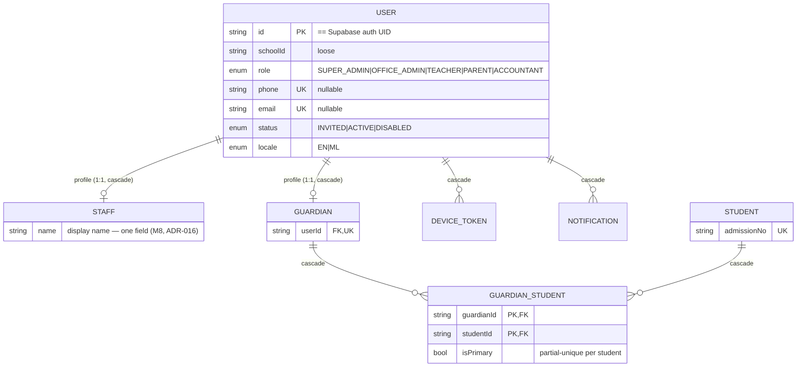
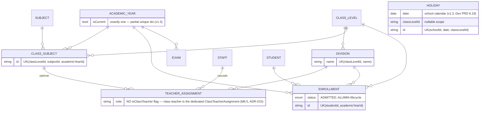
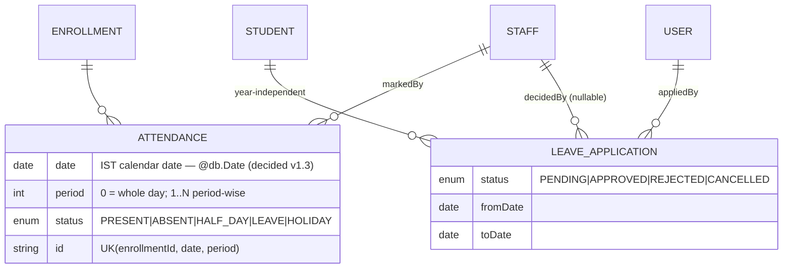
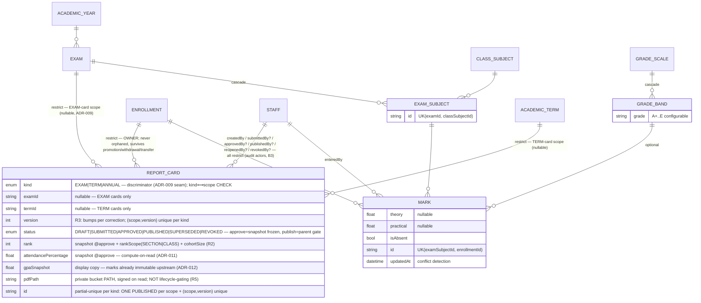
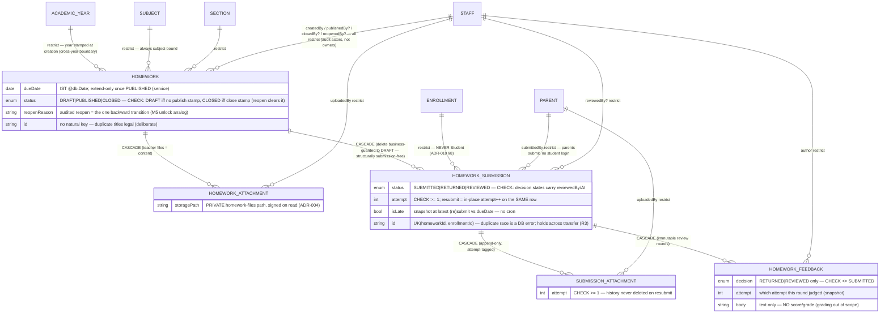
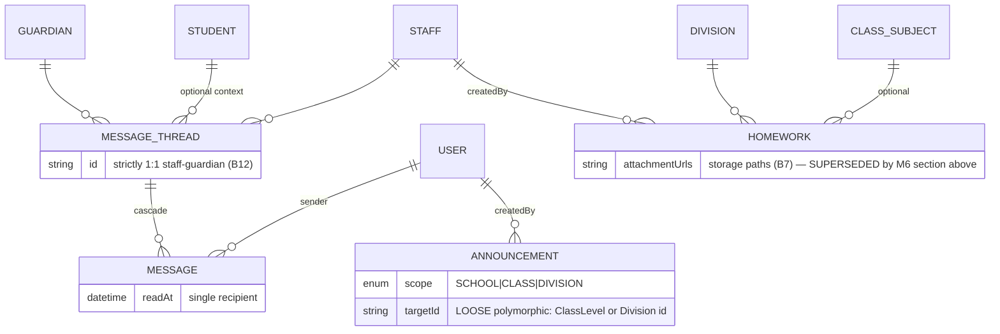
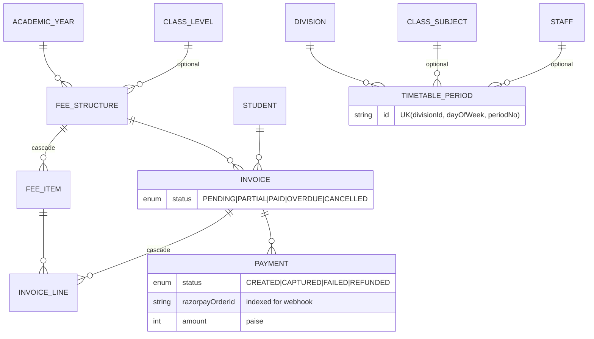

# Database Relationship Diagram — School Management Portal

Visual companion to Dev PRD §6 (the schema there is the source of truth). Mermaid ER diagram of the **full target schema** (all milestones + add-ons). Milestone tags show when each model's migration lands (numbering per REVIEW_FINDINGS A1 — code numbering: M1 auth, M2 people, …).

## Legend

- `||--o{` one-to-many · `||--||` one-to-one · `}o--o{` many-to-many (via join model)
- **Loose refs** (deliberately no FK): `schoolId` everywhere (ADR-008), `AuditLog`/`ImportJob` actor+entity (ADR-007), `Announcement.targetId` (polymorphic). Shown as dashed notes, not edges.
- Partial unique indexes (raw SQL in migrations): **M7** `ReportCard` per kind — ONE PUBLISHED per `(enrollment, scope)` + `(enrollment, scope, version)` unique (ADR-014, generalizes ADR-009's `examId`-nullable seam); `GuardianStudent(studentId) WHERE isPrimary`; `AcademicYear(schoolId) WHERE isCurrent` (adopted v1.3 — exactly one current year).

## Identity & people (M1–M2)

## Academic structure & enrollment (M2)

## Attendance & leave (M3 attendance, M5 leave)

Leave→Attendance bridge (no FK): on APPROVED, service resolves `studentId → current ACTIVE Enrollment` and upserts `Attendance(LEAVE)` per school day (§8.7; school-day source = calendar model, REVIEW_FINDINGS B1).

## Exams, marks, report cards (M4)

> **Report cards IMPLEMENTED in M7** (`20260710030000_report_card_management`, ADR-014) —
> the `REPORT_CARD` block below reflects the shipped model, superseding the ADR-009
> `examId`-only sketch. It is a LEAF reporting table (no children): **9 FKs, ALL Restrict,
> no Cascade/SetNull in or out**. Delete rules + rollback-safety **live-verified** M7 Step 3
> (matrix 9/9 exact; D1–D5 delete-blocked incl. year-cascade precision; P1–P3 cards survive
> promotion/transfer/withdrawal by construction — key to the immutable enrollment; 0 rows
> persisted). Owner = Enrollment (ADR-010 §8); Exam/Term/Year are scope, not owners.

## Homework & submissions (M6 — IMPLEMENTED per ADR-013)

> This section reflects the **implemented** schema (`20260710000000_homework_management`),
> which supersedes the Dev PRD §8.6 distribution-only sketch below (the `HOMEWORK`
> entity under "Communication & notifications" — `DIVISION`-era vocabulary, no
> submissions). The M6 brief made parent submissions **core**; ADR-013 is the source
> of truth. Delete rules **live-verified** M6 Step 3 (rollback-safe probes R1–R10:
> 17/17 FK rules exact, promotion/transfer history preservation, cascade precision,
> durable actors, guarded-transition primitives, zero probe rows persisted).

Cross-table invariants **not** in the DB (service layer, ADR-013 §7): section match,
year match, ACTIVE enrollment, StudentParent link, PUBLISHED-only submission.
Ownership derives from `TeacherAssignment(teacher, subject, section)` at authz time —
no owner column to rot.

## Communication & notifications (M5-planned — NOT built)

> The `HOMEWORK` entity in this sketch is **superseded by the implemented M6 model
> above** (distribution-only → full submissions; brief overrides Dev PRD decision #13).
> Messages/announcements remain future work.

## Ops, flags, add-ons (M1 audit/flags; add-ons behind flags)

Standalone (loose refs only): `SCHOOL` (tenant root), `AUDIT_LOG(actorUserId, entityType, entityId, before/afterJson)`, `IMPORT_JOB`, `FEATURE_FLAG(UK schoolId+key)`.

**Adopted v1.3:** `Holiday(schoolId, date, name, classLevelId?)` + working-weekday config in typed `SchoolSettings` (Dev PRD §8.19) — the school-day source of truth for leave approval and the absence job. Storage fields are now `*Path` (`logoPath`, `photoPath`, `pdfPath`, `attachmentPaths`, `filePath`) per decision #24.

## onDelete policy summary (DATABASE_CONVENTIONS §7)

| Cascade (composition) | Restrict (history/money) |
|---|---|
| Staff/Guardian→User, GuardianStudent, DeviceToken, Notification, GradeBand→Scale, ExamSubject→Exam, Message→Thread, FeeItem→Structure, InvoiceLine→Invoice, **M6:** HomeworkAttachment→Homework, HomeworkSubmission→Homework (delete business-guarded to DRAFT), SubmissionAttachment→Submission, HomeworkFeedback→Submission | Mark, Attendance, Enrollment, Invoice, Payment, ReportCard, LeaveApplication, all academic structure, **M6:** Submission→Enrollment/Parent, every homework Staff/Parent actor, Homework→Year/Subject/Section, **M7:** ReportCard→Enrollment/Exam/Term + all 6 Staff actors |

**M6 note:** the homework tables use **no SetNull** — verified live (R1: 17/17 FK
delete rules exact; only Cascade content edges + Restrict data/actor edges).

**M7 note:** `ReportCard` is a **leaf** — **9 FKs, all Restrict, no Cascade/SetNull** in or
out. Verified live (Step 3): matrix 9/9 exact; a published card can never be orphaned or
cascade-deleted, and survives promotion/withdrawal/transfer because it keys to the immutable
enrollment (ADR-014 §8). Cascade precision: deleting the `AcademicYear` is blocked upstream at
`Enrollment→AcademicYear` (Restrict), so no cascade can reach a term a card scopes.
